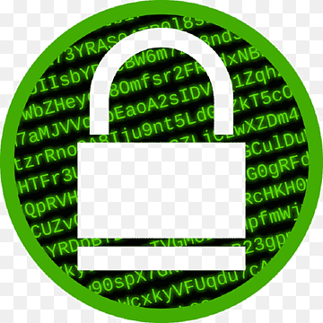
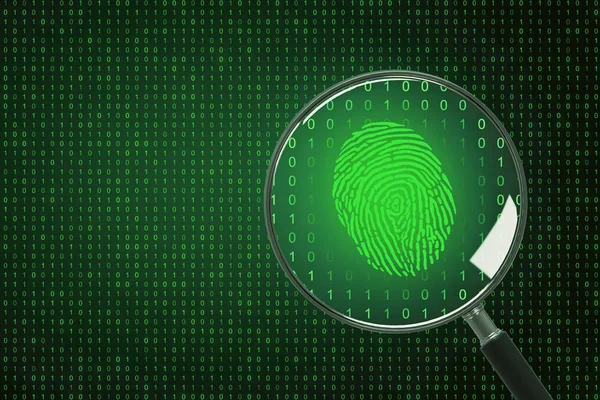

# Encriptador de Texto - Proyecto Desafío



## 📜 Descripción del Proyecto

Este es un encriptador de texto sencillo diseñado para transformar cadenas de texto en un formato cifrado utilizando un sistema de sustitución de caracteres específico. La herramienta también permite desencriptar el texto cifrado de vuelta a su formato original.

## 🚧 Estado del Proyecto

  
Este proyecto se ha completado y está en su versión final.

## 🎯 Características

- **Encriptación de Texto:** Convierte texto plano en un formato cifrado utilizando un sistema de sustitución simple.
- **Desencriptación de Texto:** Permite volver al texto original a partir del formato cifrado.
- **Validación de Entrada:** Solo se aceptan letras minúsculas sin acentos, y se verifican las condiciones del texto antes de proceder con la encriptación o desencriptación.

## 📸 Capturas de Pantalla

### Interfaz de Usuario Inicial


### Texto Encriptado


### Texto Desencriptado


## 🔧 Tecnologías Utilizadas

- **HTML5**
- **CSS3**
- **JavaScript**
- **SweetAlert** para alertas interactivas

## 🚀 Acceso al Proyecto

Puedes acceder al proyecto en línea en el siguiente enlace:  
[Encriptador de Texto](https://andresluna-ing.github.io/encriptador-desafio/)

### Clonar y Ejecutar Localmente

```bash
git clone https://github.com/tu-usuario/encriptador-desafio.git
cd encriptador-desafio
